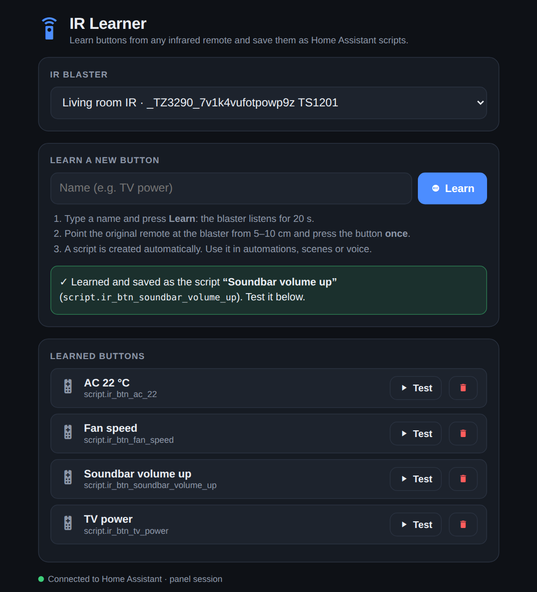
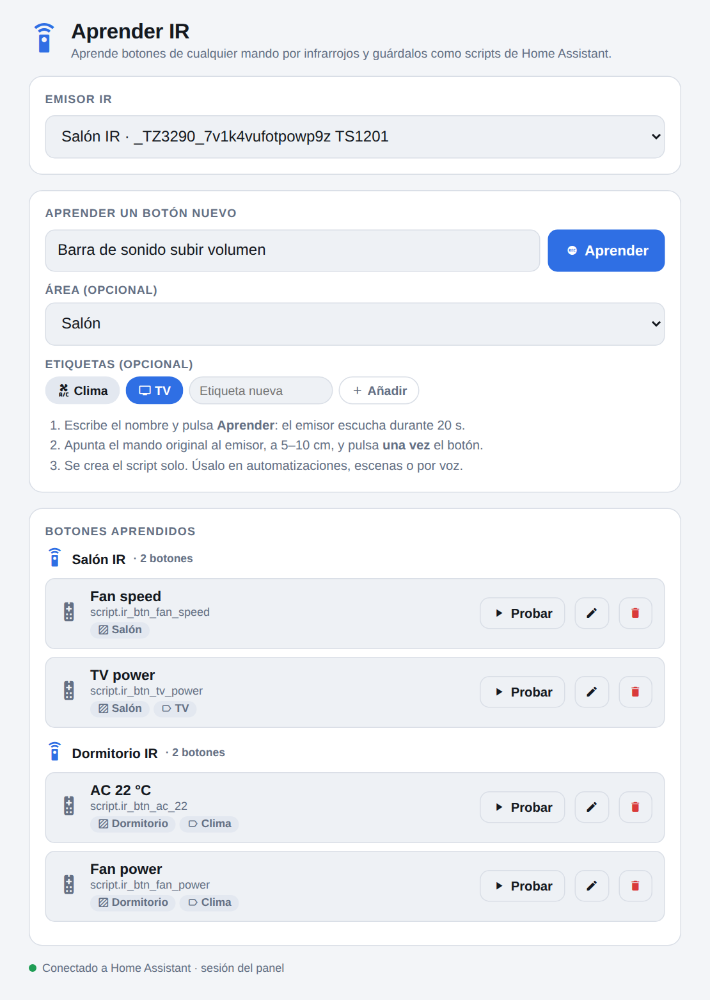

# ZHA IR Learner

**Learn infrared remote buttons with a Zigbee IR blaster in Home Assistant (ZHA) — and get a ready-to-use script for each one.**

Learning IR codes with a Tuya ZS06-style blaster in ZHA normally means calling cluster commands by hand in *Developer tools*, digging into *Manage Zigbee clusters* to read a long attribute, and copying it into a script yourself. This is a single HTML page that does all of that for you:

1. Type a name (e.g. *TV power*), optionally pick an **area** and **labels**, and press **Learn**.
2. Point your original remote at the blaster and press the button once.
3. A Home Assistant script (`script.ir_btn_tv_power`) is created automatically, already assigned to that area and those labels. Use it in automations, scenes, dashboards or with voice.

Learned buttons are listed **grouped by IR blaster**, each with *Test*, *Edit area & labels* and *Delete*.

<p align="center">
  
  
</p>

No custom integration, no HACS, no YAML to edit: it's one static file served by Home Assistant itself.

> [!IMPORTANT]
> The Home Assistant user opening the page must be an **administrator**. The page creates and deletes scripts, sets areas and creates labels, and Home Assistant only allows that to admins. Non-admin users get an *HTTP 401/403* error when saving.

## Compatible hardware

| Device | Zigbee model | Manufacturer ID | Status |
|---|---|---|---|
| **Tuya ZS06** Zigbee IR blaster (USB powered) | `TS1201` | `_TZ3290_7v1k4vufotpowp9z` | ✅ Tested |
| Other Tuya/Moes `TS1201` IR blasters (e.g. UFO-R11) handled by the `zhaquirks.tuya.ts1201` quirk | `TS1201` | `_TZ3290_…` | ⚠️ Should work, not tested |

The page lists every ZHA device whose model is `TS1201` or whose quirk is `ts1201`/`Zosung`, so you can pick the right one if you have several.

To check yours: **Settings → Devices & services → ZHA → your device**. The device info should show model `TS1201`, and the *Zigbee info* should show a quirk like `zhaquirks.tuya.ts1201.ZosungIRBlaster_ZS06`.

## Requirements

- Home Assistant with the **ZHA** integration (Zigbee2MQTT is **not** supported — it uses a different API).
- The IR blaster paired with ZHA (see below).
- An **administrator** user (see the note above): the page creates and deletes scripts through the same API the HA script editor uses, and edits areas and labels in the entity registry.

## Installation

1. **Pair the IR blaster with ZHA**
   Press and hold the button on the blaster for ~5 s until the LED blinks, then in Home Assistant go to **Settings → Devices & services → ZHA → Add device**. Give it a name (e.g. *Living room IR*).

2. **Copy the page into Home Assistant**
   Download [`ir-learner.html`](ir-learner.html) and put it in your config folder under `www/`:
   ```
   /config/www/ir-learner.html
   ```
   You can use the *File editor* or *Studio Code Server* add-on, Samba, or SSH. If the `www` folder did not exist before, **restart Home Assistant** once so it starts serving it.

3. **Add it as a panel**
   **Settings → Dashboards → Add dashboard → Webpage**
   - URL: `/local/ir-learner.html?v=1` — use this **relative** URL (no `http://…`), so it also works from the mobile app and remote access (https).
   - Title: `IR Learner` · Icon: `mdi:remote`

   It will appear in the sidebar. Opened this way, the page reuses your Home Assistant session: no token needed.

   *Optional:* force the language with `/local/ir-learner.html?lang=en` or `?lang=es` (otherwise it follows your browser).

## Usage

1. Choose your IR blaster (only needed if you have more than one).
2. Type a name for the button. Optionally choose an **area** and one or more **labels** (you can create a new label right there), then press **Learn**. The blaster listens for 20 seconds (its LED lights up).
3. Point the original remote at the blaster from 5–10 cm and press the button **once**.
4. Done: the button appears under *Learned buttons*, in the group of its blaster, with **Test**, **✏️ Edit area & labels** and **Delete**. It also appears as a script in **Settings → Automations & scenes → Scripts**, and in its area.

With several blasters you can reuse a name: if *TV power* already exists on another blaster, the new script gets the blaster's name in its id (e.g. `script.ir_btn_bedroom_ir_tv_power`).

Use the script anywhere, for example in an automation:

```yaml
actions:
  - action: script.ir_btn_tv_power
```

## How it works

The `ts1201` quirk from [zha-quirks](https://github.com/zigpy/zha-device-handlers) exposes the blaster's IR cluster `0xE004` (57348, *ZosungIRControl*). The page talks to it with standard Home Assistant APIs:

| Step | What the page calls |
|---|---|
| Start learning | `zha.issue_zigbee_cluster_command` → cluster `57348`, `cluster_type: in`, **command `1`**, `params: {on_off: true}` |
| Read the learned code | WebSocket `zha/devices/clusters/attributes/value` → attribute `0` (`last_learned_ir_code`). This is what *Manage Zigbee clusters* uses. The page polls it every second until it changes. |
| Save the button | `POST /api/config/script/config/ir_btn_<name>` with a script whose only action sends the code |
| Send the code | `zha.issue_zigbee_cluster_command` → cluster `57348`, **command `2`**, `params: {code: "<learned code>"}` |
| Area & labels | WebSocket `config/entity_registry/update` on the script entity (`config/label_registry/create` for new labels) |
| Group by blaster | the blaster's IEEE is read back from each script's config (`GET /api/config/script/config/<id>`) |

Each generated script looks like this, so you can also write or edit them by hand:

```yaml
ir_btn_tv_power:
  alias: TV power
  icon: mdi:remote-tv
  mode: single
  sequence:
    - action: zha.issue_zigbee_cluster_command
      data:
        ieee: "aa:bb:cc:dd:ee:ff:00:11"   # your blaster's IEEE
        endpoint_id: 1
        cluster_id: 57348
        cluster_type: in
        command_type: server
        command: 2
        params:
          code: "B6oRqhE1Ao8G4AED..."        # the learned code
```

Codes are often longer than 255 characters, the limit of an `input_text` helper. That's why each code lives inside its own script instead of a text helper.

## Updating

Home Assistant tells browsers to cache files under `/local/` for a month. After replacing `ir-learner.html` with a newer version, **change the panel URL** so the browser fetches the new file, e.g. from `/local/ir-learner.html` to `/local/ir-learner.html?v=2` (then `?v=3` next time, and so on).

## Tips & known limitations

- **Learning the same button twice in a row** is not detected: the code does not change, and the page can't tell a new capture from the old one. Delete the button first, or learn any other button in between.
- **Nothing is captured?** Move the remote closer and aim it straight at the blaster. Some remotes (e.g. air conditioners) send long codes, so hold the button a little longer.
- **The learned code works, but the device doesn't react?** The blaster needs a clear line of sight to the TV/AC when sending.
- **HTTP 401/403 when saving** means the logged-in user is not an administrator.
- Opened **outside** a Home Assistant panel (e.g. directly in a browser), the page asks for a long-lived access token (**Profile → Security**) and stores it in that browser's local storage.

## Alternatives

Other ways to use these IR blasters with Home Assistant, depending on what you need:

| Project | Type | Best for |
|---|---|---|
| **ZHA IR Learner** (this) | One HTML file, no install | Quickly turning remote buttons into plain HA scripts (with area & labels) |
| [IR Learning Hub](https://github.com/slawa19/IR-Learning-Hub) | Custom integration (HACS) + Lovelace card | A full command library: devices/locations, native `remote`/`media_player` entities, export/import |
| [SmartIR](https://github.com/smartHomeHub/SmartIR) ([ZS06/UFO-R11 guide](https://community.home-assistant.io/t/guide-how-to-use-the-zs06-or-ufo-r11-zigbee-ir-controllers-with-smartir/939301)) | Custom integration | Climate / media entities from ready-made code databases (e.g. air conditioners) |
| Manual: *Manage Zigbee clusters* ([guide](https://jacroe.com/journal/post/2026-04-22-23-33-47_setting-up-using-tuya-zigbee-ir-remote)) | Built into ZHA | Learning one or two codes by hand |

Home Assistant 2026.4 added a native infrared framework, but as of now TS1201 blasters in ZHA still don't expose native IR entities or a learning UI.

## Contributing

Tested on a single device model so far. If it works (or doesn't) with your `TS1201` variant, please open an issue with the model and manufacturer ID shown by ZHA.

## License

[MIT](LICENSE)
